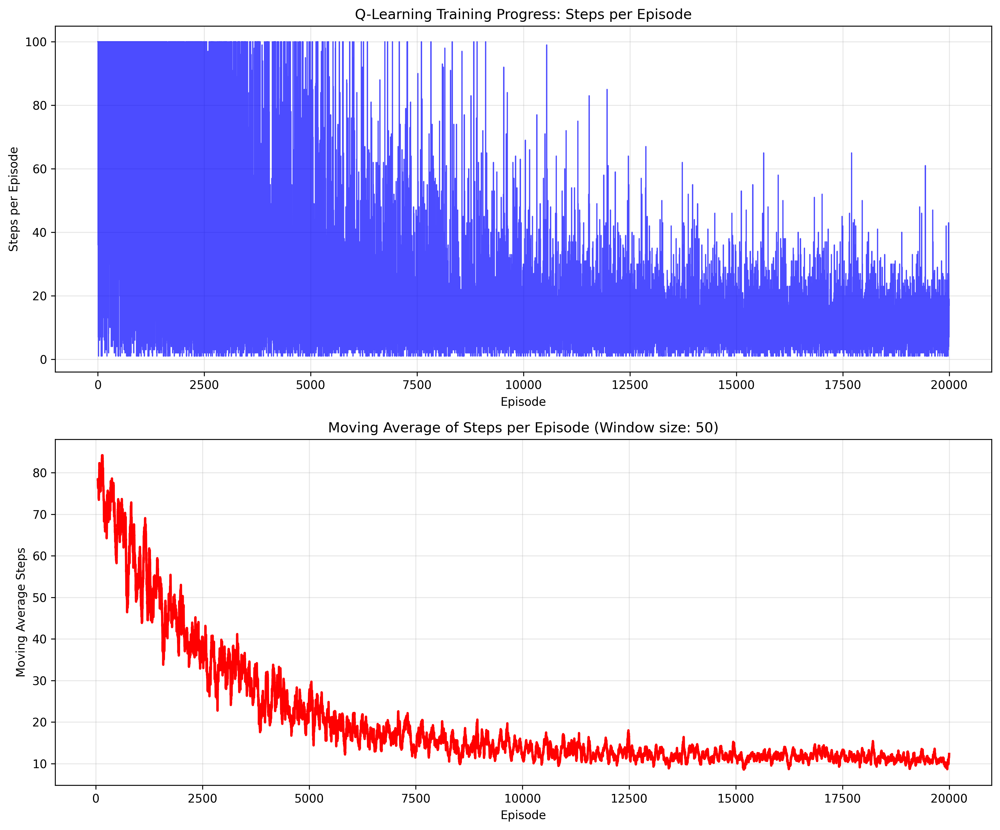

I used your basiccode to play with enviroment.
Maked Goal to be randomly generated.
Updated code and added training plots.

It seems that agent really needs at least 10000 steps to learn something.

